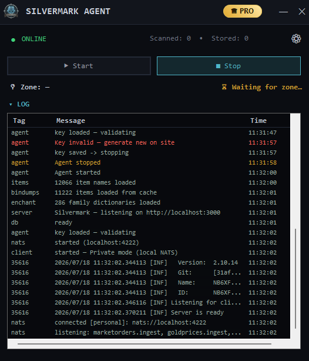
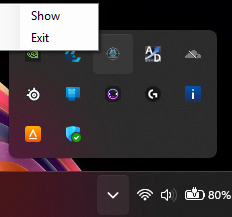
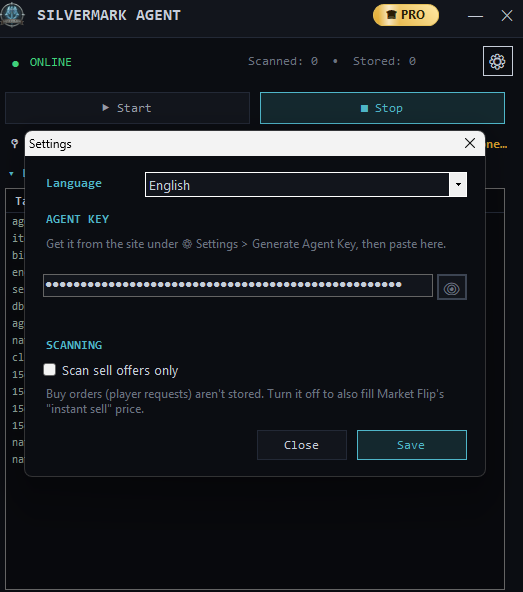

# Silvermark Agent

**Albion Online market terminal — a local, privacy-first scanning agent for Windows**

[**⬇ Download latest**](https://github.com/silvermark-albion/silvermark-agent/releases/latest) · [Install](#-installation) · [Features](#-features) · [FAQ](#-faq) · [Security](#-security--privacy)

---

> ### ⚠️ First launch
> On first run the agent asks for your **agent key** (get it from [silvermark.app](https://silvermark.app)). It then runs quietly in the **system tray** and captures market prices automatically while you play. If **Npcap** is missing it will guide you through the one-time install.

---

## 💻 What is Silvermark Agent?

Silvermark Agent is a lightweight Windows app that captures Albion Online market prices **on your own machine** as you browse the market in-game. The captured data powers price tracking, cross-city flip opportunities, gold trends and upgrade-profit analysis on **[silvermark.app](https://silvermark.app)**.

It reads game network traffic **passively** — it does not modify, inject into, or automate the game in any way.

---

## 🚀 Features

| Feature | Description |
|---------|-------------|
| 🛰️ **Market capture** | Sell/buy order prices captured the moment you open a market |
| 💱 **Cross-city flips** | Feeds flip analysis with tax-adjusted net profit on silvermark.app |
| 📈 **Price history** | Builds historical price & gold trends for any item |
| ⬆️ **Upgrade profit** | Data for enchant/upgrade cost & profit calculations |
| 🔒 **Private mode** | Default: scans go only to your account, never to third parties |
| 🔄 **Auto update check** | New version → an update icon appears in the window |
| 🖥️ **System tray** | Runs minimized, out of your way |
| 🌐 **15 languages** | Full UI localization |
| 🔑 **No admin needed** | Runs as a normal user (only Npcap install needs elevation) |

---

## 📥 Installation

> Windows 10 / 11 (64-bit). Two packages — pick one:

### Installer (recommended)
1. Download **`Silvermark-Setup.exe`** from the [latest release](https://github.com/silvermark-albion/silvermark-agent/releases/latest).
2. Double-click it and follow the wizard — a desktop shortcut is created.
3. Launch **Silvermark**, paste your agent key from [silvermark.app](https://silvermark.app).

### Portable (no install)
1. Download **`Silvermark-portable.zip`** and extract it to any folder.
2. Run **`Silvermark.exe`**.

### Windows SmartScreen warning

Both packages are **unsigned** — Silvermark has no code-signing certificate yet, so Windows and your browser show an "unknown publisher" warning. This is expected. How to get past it:

**If your browser blocks the download** (Edge / Chrome): open the downloads list, click the **⋯** next to the file → **Keep** → **Keep anyway**.

**If you see the blue "Windows protected your PC" dialog** when running it:
1. Click **More info**.
2. Click **Run anyway**.

**Alternative** — unblock the file before running it: right-click the downloaded file → **Properties** → tick **Unblock** at the bottom → **OK**.

> The warning reflects a missing signature and no download reputation — not a detected threat. SmartScreen builds reputation per file as more people download it, so the prompts fade for a given release, then reappear for each new version until a signing certificate is in place.

> On first launch, if **[Npcap](https://npcap.com/#download)** isn't installed the agent guides you through it — it's required to capture game packets.

---

## 💻 System Requirements

- **Windows 10 / 11** (64-bit)
- **[Npcap](https://npcap.com/#download)** — packet capture driver (the agent guides you)
- **VPN / WARP disabled** — while active, game scans can't be captured
- A free **[silvermark.app](https://silvermark.app)** account + agent key

---

## 📊 Features Showcase

**Agent window** — live status, current zone, scan readiness, PRO badge.

**System tray** — the agent keeps running minimized; right-click for show/exit.

**Settings** — agent key, language, and scan options.

---

## 🔒 Security & Privacy

- **Private mode (default):** your scans go only to your own account — **never** to any third party.
- Your agent key is stored **encrypted** on your device (Windows DPAPI) — only decryptable under your Windows account.
- The agent reads network traffic **passively**; it never modifies, injects into, or automates the game.
- This package contains **no** personal keys or passwords.

---

## 🔄 Updating

On startup the agent checks the latest release. If a newer version exists, a green **⬇** icon appears in the window title — click it to download the newest package. Your settings and captured data are preserved.

---

## ❓ FAQ

**Is this allowed / will I get banned?**
The agent only **reads** network traffic your PC already receives — the same passive approach used by the long-standing, community-wide Albion Data Project client. It does **not** modify the game, read game memory, inject code, or automate anything. Use at your own discretion.

**Why does Windows say "unknown publisher" or block the installer?**
The packages aren't code-signed yet, so SmartScreen has no reputation for them. See [Windows SmartScreen warning](#windows-smartscreen-warning) for the exact click-through steps.

**Does it need admin rights?**
No. The agent runs as a normal user. Only the one-time **Npcap** driver install needs elevation.

**Why do I need Npcap?**
Npcap lets the agent see the game's market packets. Without it, nothing can be captured.

**Why does VPN break it?**
A VPN/WARP tunnels your traffic elsewhere, so the local capture driver can't see the game packets. Disable it while scanning.

**Where is my data?**
Locally on your machine. In private mode nothing is shared with third parties.

**Is it free?**
Yes. A PRO tier unlocks extra site features, but the agent and core scanning are free.

---

## 🔗 Related

- **[silvermark.app](https://silvermark.app)** — the market terminal this agent feeds
- **[Npcap](https://npcap.com)** — required packet capture driver

---

## 📄 License

Free to use. Closed-source; distributed as binaries only. Not affiliated with, endorsed by, or associated with Sandbox Interactive / Albion Online.

---

Silvermark · <a href="https://silvermark.app">silvermark.app</a>

